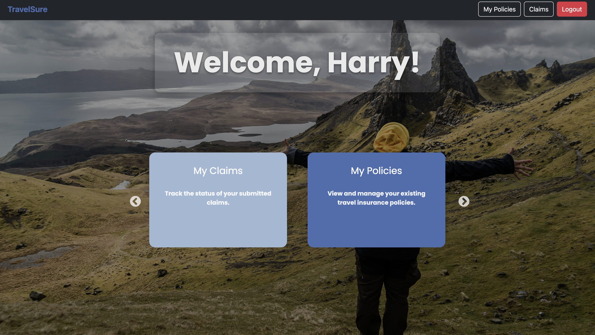
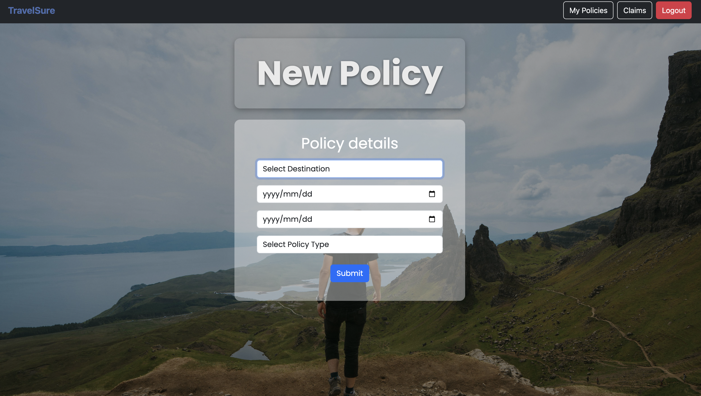

# TravelSure Frontend

This project serves as the frontend component for the TravelSure backend App.

## About

This is a demo travel insurance app that allows users to sign up, create, and manage policies. It is intended solely as a practice project to develop skills with React and TypeScript, and to serve as a functional frontend for integrating and testing backend APIs. It is not designed as a production-ready application.

## Features

- Responsive UI built with React and TypeScript
- API integration with the [TravelSure backend](https://github.com/Wynand91/travelsure)
- Onboarding/Authentication
- Policy management
- Form validation and error handling (Still needs some cleaning up)

## Tech Stack

- **Frontend:** React, TypeScript
- **Styling:** Bootstrap

## Getting Started

### Prerequisites

- Node.js (version 24.1.0 or higher)
- npm
- TravelSure backend set up and running (see [TravelSure repo](https://github.com/Wynand91/travelsure) for instructions) - This frontend expects the backend to run on port `8000`

> Note! In order to create a claim for a policy, the policy need to be **paid** and either in a '**Active**' or '**Expired**' state. You will have to update these in the backend Admin for the corresponding policy (With backend running, go to `http://localhost:8000/admin/policy/policy/` -> find and click on policy -> tick 'Paid' box, and change 'Status' -> Save)

### Installation

1. Clone the repo:

   for ssh:

   ```bash
   git clone git@github.com:Wynand91/travelsure-fe.git (ssh)
   cd your-repo
   ```

   for https

   ```bash
   git clone https://github.com/Wynand91/travelsure-fe.git (https)
   cd your-repo
   ```

2. cd into travelsure-fe

3. Install dependencies:

   ```bash
   npm install
   ```

4. Start the development server:

   ```bash
   npm run dev
   ```

5. Open your browser and go to http://localhost:5173

## Screenshots running app






## License

This project is licensed under the MIT License.
